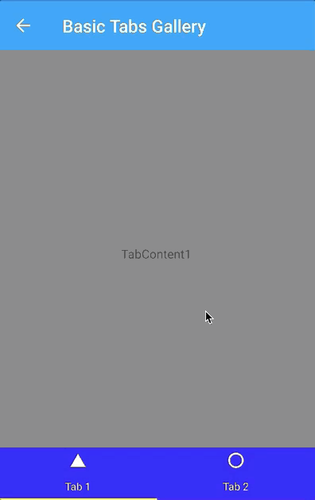
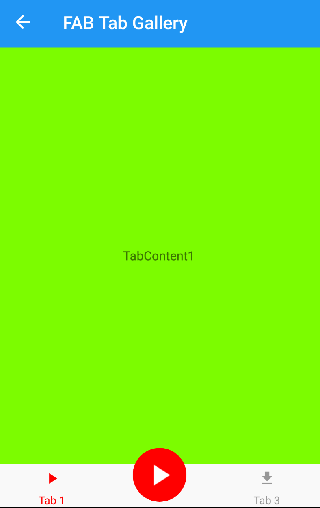
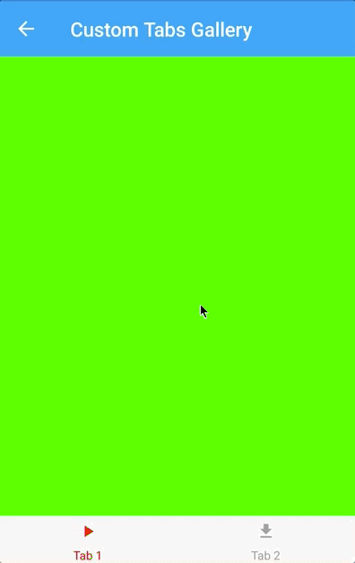
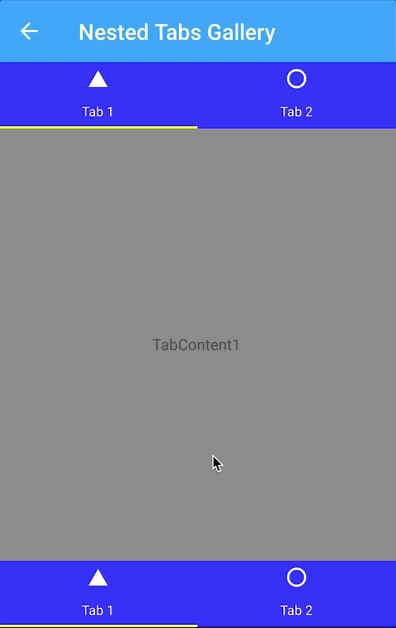
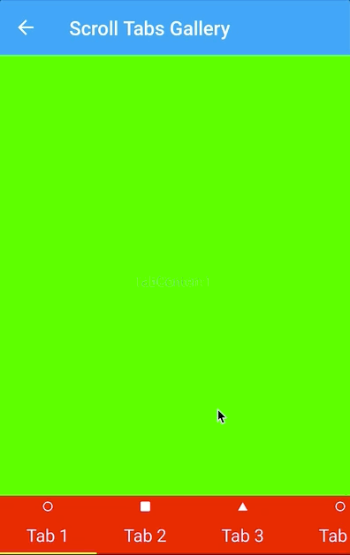
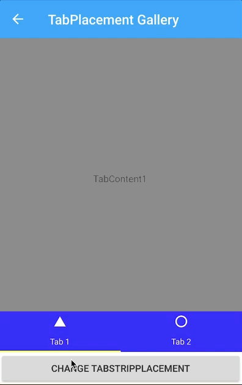
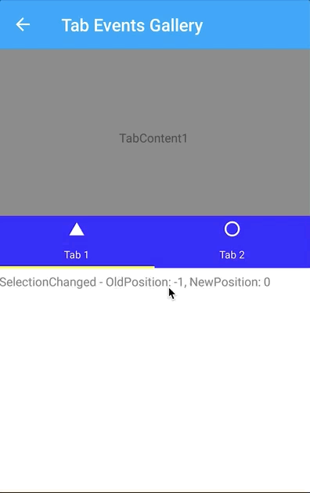

# TabView

The TabView is a way to display a set of tabs and their respective content. TabViews are useful for displaying several views of content.

```
<TabView 
    TabStripPlacement="Bottom"
    TabStripBackgroundColor="Blue"
    TabStripHeight="60"
    TabContentBackgroundColor="Yellow">
    <TabViewItem
        Icon="triangle"
        Text="Tab 1"
        TextColor="White"
        TextColorSelected="Yellow"
        FontSize="12">
        <Grid 
            BackgroundColor="Gray">
            <Label
                HorizontalOptions="Center"
                VerticalOptions="Center"
                Text="TabContent1" />
        </Grid>
    </TabViewItem>
    <TabViewItem
        Icon="circle"
        Text="Tab 2"
        TextColor="White"
        TextColorSelected="Yellow"
        FontSize="12">
        <Grid>
            <Label    
                HorizontalOptions="Center"
                VerticalOptions="Center"
                Text="TabContent2" />
        </Grid>
    </TabViewItem>
</TabView>
```
 

Sounds good, but ... _why create this control?_.

This control has been created with the idea of being able to customize absolutely everything in a simple way.
- **Fully customized tabs**. You can customize the content of each tab, the tabstrip, the tab indicator or the tab content.
- Lazy loading support.
- Nested tabs in any way.
- Gestures support.
- Badges support, etc.
  
 

## TabView

| Property   |      Type      |
|----------|:-------------:|
| IsLazy |  Bool |
| SelectedIndex |  Int |
| TabStripPlacement |    TabStripPlacement   |
| TabStripBackgroundColor | Color |
| TabStripBackgroundView | View |
| TabIndicatorColor | Color |
| TabIndicatorHeight | double |
| TabIndicatorWidth | double |
| TabIndicatorPlacement | TabIndicatorPlacement |
| TabIndicatorView | View |
| TabContentBackgroundColor | Color |
| TabContentHeight | Double |
| TabStripHeight | Double |
| TabContentHeight | Double |
| IsTabTransitionEnabled | Bool |
| IsSwipeEnabled | Bool |


| Event   |      Description      |
|----------|:-------------:|
| SelectionChanged |   |
| Scrolled |   |

## TabViewItem

| Property   |      Type      | 
|----------|:-------------:|
| Text |  String |
| TextColor |    Color   |
| TextColorSelected | Color |
| FontSize | FontSize |
| FontSizeSelected | FontSize |
| FontFamily | String |
| FontFamilySelected | String |
| FontAttributes | FontAttributes |
| FontAttributesSelected | FontAttributes |
| Icon | ImageSource |
| IconSelected | ImageSource |
| Content | View |
| BadgeText | Bool |
| BadgeTextColor | Color |
| BadgeBackgroundColor | Color |
| BadgeBackgroundColorSelected | Color |
| IsSelected | Bool |
| TapCommand | ICommand |


| Event   |      Description      |
|----------|:-------------:|
| TabTapped |   |

## Upcoming features

- Include **TabItemsSource** property in TabView to be able to add tabs from a source dynamically.
- TabItemTemplate (DataTemplate).
- Allow to disable or hide Tabs.
- Support RTL.
- Accesibility support.
- More TabStrip customization: TabStripBorderColor and TabStripBorderWidth.
- Review integration with Visual and Shell.
  
## Screenshots

       

## Copyright and license

Code released under the [MIT license](https://opensource.org/licenses/MIT).